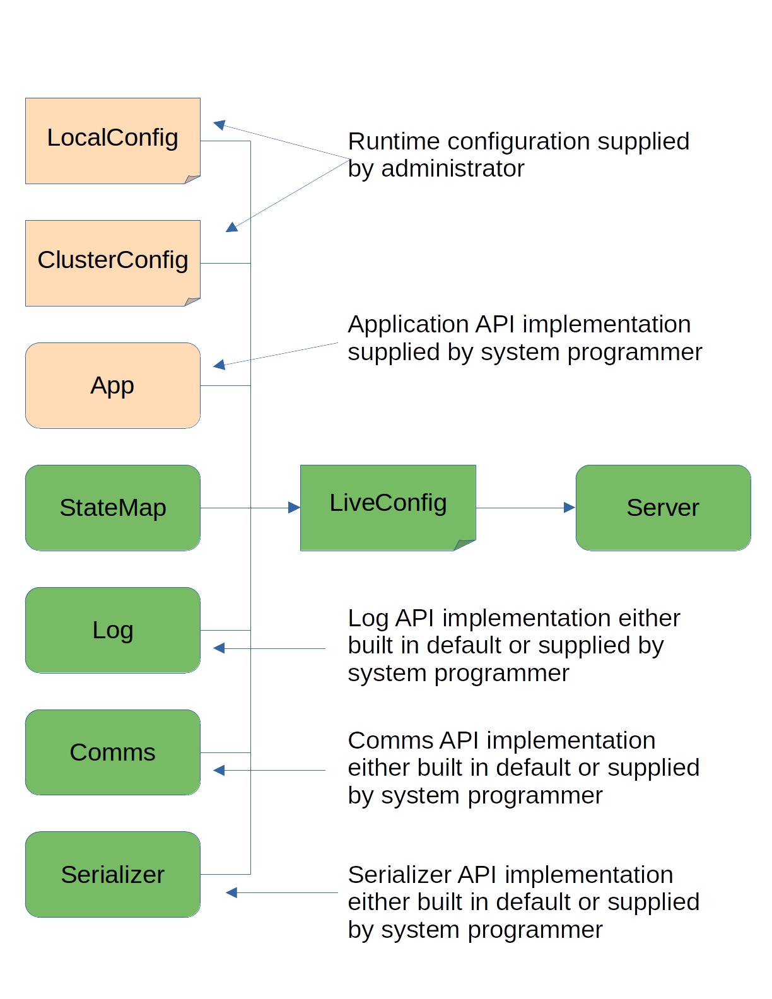

.. _main_components:

###############
Main Components
###############

******	   
Server
******

Overview
========

The central component of the RaftFrame library, and instance of this
class is the essentially the "main loop" of the library runtime.
After constructing a Server object
(:class:`raftframe.servers.server.Server`), the caller can then calls
its start method. This begins asynchronous processing of the elements
of the raft algorithm, so the caller must respect the requirements of
a python async program.

In a simple case the only caller supplied code
that would run after this call would be through methods of the App
API, called by the Server object when a new client command is
received, or when the cluster leadership changes.

In a more realistic case the App will have other things to do and
will do them independently of the raftframe code, except when it is time
to send or receive a distributed state change operation. The App
developer my not want to be part of the same async event loop as the
raftframe code, so threading or multiprocessing should be used to isolate
the two processing realms. Care must be taken to ensure that the App
code honors the need to confirm state changes before reporting to client.
The best way to do that is to serialize the change operation in some
way and only send the reply to the client after the raftframe leader
reports it committed. 

Future Feature
--------------

As of May 17, 2023, the only method for sending messages to do the
caller's App processing is via the same comms channel used for raft
messages, and the message is actually received and processed by the
:class:`raftframe.states.leader.Leader` code. This is an artifact of
the history of development of this library as a demonstration. Changes
are planned that will allow the more natural mode where the App
instance has its own communications method for messages and it calls
the leader code when it wants to do an operation that is supposed
to be coordinated and logged by raft. `<https://github.com/dlparker/raftframe/issues/1>`_

Startup
=======

This class expects
to recieve some configuration and a set of instances of required components for
communications, state logging, state and message serializing, and state transition
mapping. Typical programs will use the default versions of these components, but
customization is possible through implementing the APIs defined in the abstract
base clases for each of these. Developer support code and testing makes extensive
use of this technique.

It also requires that the constructor be supplied with an
implementation of the App API, which is effectively the part of the
system that does the work that is coordinated by the raft
algorithm. For example, a banking app might operate on an account,
crediting and debiting the funds in the account. The raft algorithm
would then be used to ensure that all the servers in the cluster
maintain a consistent view of the account balance in spite of a
failure of the leader server.

Startup Configuration
------------------------

Class Documentation
^^^^^^^^^^^^^^^^^^^

- :class:`raftframe.servers.server.Server`
- :class:`raftframe.servers.server_config.LocalConfig`
- :class:`raftframe.servers.server_config.ClusterConfig`
- :class:`raftframe.servers.server_config.LiveConfig`
- :class:`raftframe.comms.commms_api.CommsAPI`
- :class:`raftframe.log.log_api.Log`
- :class:`raftframe.serializers.api.SerializerAPI`
- :class:`raftframe.states.state_map.StateMap`
- :class:`raftframe.app_api.app.App`

***************
Transaction Log
***************

An integral part of the Raft algorithm is the idea that there is a
persistent storage mechanism of the append only log style that is the
resource that gets transactional control. The RaftFrame library
includes a Sqlite implementation (:class:`raftframe.log.sqlite_log.SqliteLog`)
and an API definition via an abstract base class:
:class:`raftframe.log.log_api.Log` so that other log implementations
can be provided.

The log implementation is used to store data for the application, but
it stores it in a context that allows the check of "term" and commit index
values described by the protocol. There are API calls that allow the
Raft state components to examine this context, by finding the current "term",
the current record index, the current commit index, which may be less than
the current record index. It is also possible to retrieve specific log
records, and even do delete them, as is required in some recovery scenarios.

Updates to this log are performed first at the cluster Leader, then
at the Followers in response to AddEntries messages from the Leader,
in both cases without a commit. Then, once the Leader receives enough
acknowledgements, it commits the record locally and then sents a message
to the Followers to cause them to commit the record. More details apply
here, but you'd be better off reading the Raft PDF at
`<https://github.com/dlparker/raftframe/blob/master/raft.pdf>`_ and examining
the Leader and Follower code if you want a complete understanding.`

*****
Comms
*****

The Comms API, :class:`raftframe.comms.commms_api.CommsAPI` provides the server with
a message passing mechanism for Raft algorithm messages. These are not RPCs, just
messages. The interface is async, so it should be possible to use almost any method
of message delivery to implement the API.

The built in UDP based implementation is, at time of writing (May 18,
2023), not suitable for production use. There is a ticket active to fix that:
`<https://github.com/dlparker/raftframe/issues/3`>_.

***
App
***

The App API :class:`raftframe.app_api.App` provides, from the point of
view of the RaftFrame library, the operations that change distributed
state, resulting in log entries and synchronizing messages to non
leader servers. Note that this means that the App code in non-leader
servers must read this state from the local log, not from some
external store, and in leader servers must only write this state in
coordination with the Leader code, so that the two phase commit
semantics are preserved. In other words, if the App code wants to
write state, it must trigger the Leader to do it and wait for the
resulting record to be committed. Any operations on state during the
interval before commit must not depend on the contents of the new log
record.

**********
Serializer
**********

The Serializer API class :class:`raftframe.serializers.api.SerializerAPI` may
be used by nd Comms implementations. In one server, the
same serializer may be used for both, or two different serializers may be used
for each. There are methods for serializing and deserializing messages, log records
and dictionaries. The primary implementation currently used is msgpack, which has
limits on what kind of python objects it can handle. If the App data that is going
to be shared via messages and stored in log records has anything other than base
python types in it (including lists and dicts) then a custom serializer will be
needed.

*******************
States and StateMap
*******************

The State classes based on :class:`raftframe.states.base_state.State`
incorporate the Raft protocol rules for each of the roles that a
server may take; Follower, Candidate and Leader. Every server starts
out as a Follower, and it waits to be contacted by the Leader. If it
does not get a heartbeat in a specific amount of time, it changes to
the Candidate state and sends out requests to all the other known
cluster member servers asking them for their vote. If the Candidate
receives enough votes, it becomes Leader and sends a heartbeat to all
other members. There are a number of wrinkles involved in handling the
state transitions, so read the PDF if you want a correct understanding
`<https://github.com/dlparker/raftframe/blob/master/raft.pdf>`_.

The startup process happens when the Server object calls the StateMap
object's activate method. This instantiates a Follower object and
starts it. When a State class decides to switch to another state, it
does some cleanup operations and then calls the StateMap switch_to_XXX where
XXX is the target state. The StateMap handles instantiating the new state
object and starts it.

The :class:`raftframe.states.state_map.StateMap` included the concept
of a StateChangeMonitor, the API of which is defined at
:class:`raftframe.app_api.app.StateChangeMonitor`. This offers the
App developer a method of hooking code into the flow of state changes.
Whatever the App code wants to do at these state changes, it must not
block or long delay the state change, as this may cause timing issues
and force an election to happen.

- :class:`raftframe.states.state_map.StateMap`
- :class:`raftframe.states.follower.Follower`
- :class:`raftframe.states.candidate.Candidate`
- :class:`raftframe.states.leader.Leader`
