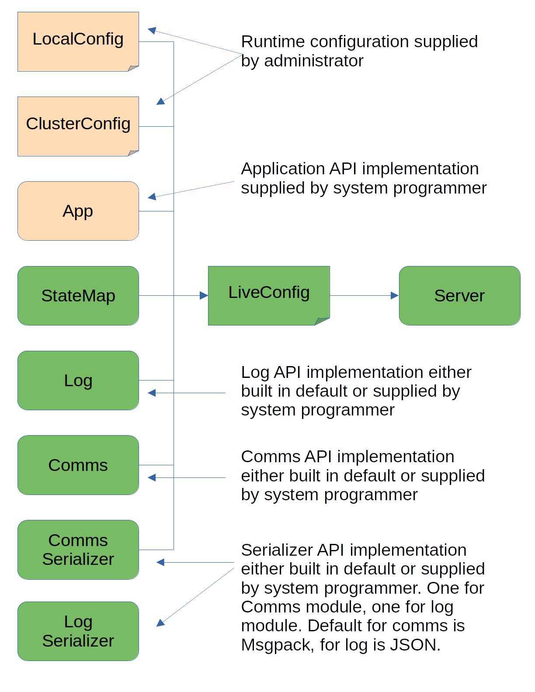

###############
Main Components
###############

************************
Server and Configuration
************************

======	   
Server
======
The central component of the raft implementation, this objects expects
to recieve some configuration and a set of instances of required components for
communications, state logging, state and message serializing, and state transition
mapping. Typical programs will use the default versions of these components, but
customization is possible through implementing the APIs defined in the abstract
base clases for each of these. Developer support code and testing makes extensive
use of this technique.

It also requires that the constructor be supplied with an
implememtaion of the App API, which is effectively the part of the
system that does the work that is coordinated by the raft
algorithm. For example, a banking app might operate on an account,
crediting and debiting the funds in the account. The raft algorithm
would then be used to ensure that all the servers in the cluster
maintain a consistent view of the account balance in spite of a
failure of the leader server.

After constructing a Server object, the caller can then call its start
method. This begins asynchronous processing of the elements of the
raft algorithm, so the caller must respect the requirements of a
python async program. In a simple case the only caller supplied code
that would run after this call would be through methods of the App
API, called by the Server object when a new client command is
received, or when the cluster leadership changes.

In a more realistic case the App will have other things to do and
will do them independently of the raftframe code, except when it is time
to send or receive a distributed state change operation. The App
developer my not want to be part of the same async event loop as the
raftframe code, so threading or multiprocessing should be used to isolate
the two processing realms. Care must be taken to ensure that the App
code honors the need to confirm state changes before reporting to client.
The best way to do that is to serialize the change operation in some
way and only send the reply to the client after the raftframe leader
reports it committed. 

Future Feature
--------------

As of May 17, 2023, the only method for sending messages to do the
caller's App processing is via the same comms channel used for raft
messages, and the message is actually received and processed by the
:class:`raftframe.states.leader.Leader` code. This is an artifact of
the history of development of this library as a demonstration. Changes
are planned that will allow the more natural mode where the App
instance has its own communications method for messages and it calls
the leader code when it wants to do an operation that is supposed
to be coordinated and logged by raft. `<https://github.com/dlparker/raftframe/issues/1>`_

===================
Class Documentation
===================

- :class:`raftframe.servers.server.Server`
- :class:`raftframe.servers.server_config.LocalConfig`
- :class:`raftframe.servers.server_config.ClusterConfig`
- :class:`raftframe.servers.server_config.LiveConfig`
- :class:`raftframe.comms.commms_api.CommsAPI`
- :class:`raftframe.log.log_api.Log`
- :class:`raftframe.serializers.api.SerializerAPI`
- :class:`raftframe.states.state_map.StateMap`
- :class:`raftframe.app_api.app.App`
